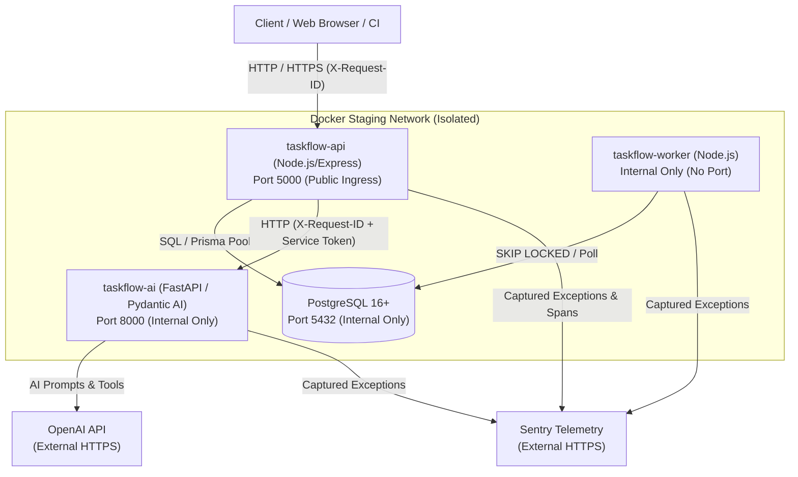

# TaskFlow Staging Observability & Service Recovery Architecture

This document defines the observability, service telemetry, request correlation, health probe semantics, and operational failure recovery architecture for the TaskFlow platform.

---

## 1. Service Topology & Network Flow

TaskFlow operates as an engineered modular monolith with four containerized services orchestrated in a dedicated virtual network (`taskflow-staging-network`):



### Architectural Network Invariants:

1. **API as Sole Public Ingress**: Only `taskflow-api` publishes a public host port (`5000:5000`).
2. **Internal-Only PostgreSQL**: `postgres` exposes port 5432 only within `taskflow-staging-network`. It has zero published host ports in staging.
3. **Internal-Only Python AI**: `taskflow-ai` exposes port 8000 only within the staging network. Web clients never communicate directly with Python.
4. **Zero-Port Background Worker**: `taskflow-worker` connects to PostgreSQL via internal DNS (`postgres:5432`) and exposes zero HTTP listening ports.
5. **Non-Root Execution**: Both `taskflow-api` and `taskflow-ai` execute under unprivileged user account `USER taskflow` (UID 10001).

---

## 2. End-to-End Request Correlation Chain

Every request traversing the platform maintains end-to-end tracing and correlation across all service boundaries:

```
Browser / HTTP Client
       │
       ▼ (Sends X-Request-ID or auto-generated UUIDv4)
TaskFlow Express API
  - Attached to req.id via requestIdMiddleware
  - Injected into res.setHeader('X-Request-ID', req.id)
  - Bound to Sentry scope: setTag('request_id', req.id)
  - Emitted in error envelope: { success: false, error: { requestId: req.id } }
       │
       ▼ (Forwarded via HTTP header: X-Request-ID: <id>)
TaskFlow Python AI Subsystem
  - Captured in FastAPI dependency / middleware
  - Bound to AI request context & Sentry scope
  - Reflected in AI response payload: { request_id: <id> }
       │
       ▼ (Upstream Provider Call / Mock Provider)
OpenAI Provider Abstraction
  - Logs correlation ID in diagnostic telemetry
```

### Invariants:

- `req.id` is never blank; if the client omits `X-Request-ID`, Express generates a fresh cryptographically random UUIDv4.
- Internal service authentication tokens (`X-TaskFlow-Service-Token`) are **never** returned to the browser or client.

---

## 3. Sentry Observability & Sensitive Data Redaction

Sentry integration (`apps/api/src/monitoring/sentry.ts` and `apps/ai/app/monitoring.py`) captures unexpected application exceptions while strictly sanitizing sensitive payloads:

### What Sentry Receives:

- **Environment**: `staging` / `production` / `development`
- **Service Identity**: `service: api`, `service: ai`, or `service: worker`
- **Request Correlation**: `request_id: <UUID>` tag and correlation context
- **Tenant Context**: `organization_id`, `project_id`, and anonymized `userId`
- **Error Classification**: Error code, HTTP status code, and stack trace

### What Sentry NEVER Receives (Strictly Scrubbed):

- **JWTs & Refresh Tokens**: Scrubbed from strings via regex `Bearer [REDACTED]` and `refreshToken=[REDACTED]`.
- **Session Cookies**: Scrubbed from headers and cookies via `{ cookies: '[REDACTED]' }`.
- **Authorization Headers**: Redacted from all HTTP event headers.
- **Internal Service Tokens**: `X-TaskFlow-Service-Token` headers and fields stripped to `[REDACTED]`.
- **OpenAI API Keys**: Regex-scrubbed via `sk-[REDACTED]`.
- **Database Passwords & URLs**: Regex-scrubbed via `postgresql://[REDACTED]@[REDACTED]`.
- **User Passwords**: Object keys matching `/password/i` are replaced with `[REDACTED]`.
- **Operational 4xx Noise**: Expected client errors (400 `VALIDATION_ERROR`, 401 `UNAUTHORIZED`, 403 `FORBIDDEN`, 404 `NOT_FOUND`, 409 `CONFLICT`) are filtered to prevent Sentry alert fatigue.

---

## 4. Structured Logging Standards

All service runtimes output structured diagnostics conforming to uniform formatting:

```json
{
  "timestamp": "2026-09-06T00:30:00.000Z",
  "level": "INFO",
  "service": "taskflow-api",
  "requestId": "550e8400-e29b-41d4-a716-446655440000",
  "organizationId": "00000000-0000-0000-0000-000000000001",
  "operation": "PROJECT_ANALYSIS",
  "message": "AI analysis completed successfully in 124ms"
}
```

### Log Sanitization Rules:

- Raw query parameters and request bodies containing sensitive fields (`password`, `token`, `secret`, `cookie`, `key`) are sanitized before log output.
- Stack traces are logged only for unhandled 5xx exceptions and never exposed in HTTP API error envelopes.

---

## 5. Health Checks vs Readiness Probes

TaskFlow separates process vitality from service readiness according to Kubernetes / container best practices:

| Endpoint                    | Path                                       | Purpose                                   | Dependencies Checked                             | AI Dependent?      | DB Dependent? | Status Codes                                               |
| :-------------------------- | :----------------------------------------- | :---------------------------------------- | :----------------------------------------------- | :----------------- | :------------ | :--------------------------------------------------------- |
| **Liveness Probe**          | `/health/live`<br/>`/api/v1/health/live`   | "Is the process alive?"                   | Process runtime only (event loop responsiveness) | **NO**             | **NO**        | `200 OK`                                                   |
| **Readiness Probe**         | `/health/ready`<br/>`/api/v1/health/ready` | "Can this service safely accept traffic?" | PostgreSQL connection pool responsiveness        | **NO** (decoupled) | **YES**       | `200 OK` (ready)<br/>`503 Service Unavailable` (not ready) |
| **Legacy / General Health** | `/health`<br/>`/api/v1/health`             | General diagnostic check                  | Service name, uptime, memory, version            | **NO**             | **NO**        | `200 OK`                                                   |

### Decoupled AI Semantics:

- **Core Invariant**: The Core API readiness probe (`/health/ready`) **does not fail** if the Python AI service is degraded or offline.
- Standard project, task, milestone, and comment CRUD remains 100% operational when AI is unavailable.
- AI-dependent requests fail in a controlled manner returning 503 (`AI_SERVICE_UNAVAILABLE`) or 504 (`AI_GATEWAY_TIMEOUT`) with automatic quota compensation.

---

## 6. Worker Lifecycle & Diagnostics

The background worker subsystem (`JobWorker` and `jobService`) executes asynchronous tasks with full diagnostic visibility:

### Worker States:

```
[Enqueued] ──> PENDING
                 │
                 ▼ (Claimed via FOR UPDATE SKIP LOCKED)
             PROCESSING
                 │
      ┌──────────┴──────────┐
      ▼                     ▼
 (Success)             (Failure)
  COMPLETED                 │
               ┌────────────┴────────────┐
               ▼                         ▼
        (Retryable Error)        (Non-Retryable Error)
               │                         │
     (Exponential Backoff)               ▼
               │                       FAILED
               ▼
            PENDING
```

### Diagnostic Telemetry Fields:

- **Job ID**: Unique UUID identifying the durable job record.
- **Job Type**: Handler identifier (e.g. `SEND_EMAIL_NOTIFICATION`, `RECOVER_STALE_JOBS`).
- **Attempt Count**: 1-indexed attempt number relative to `maxAttempts`.
- **Status Transition**: Timestamps for `createdAt`, `startedAt`, `completedAt`, and `availableAt`.
- **Exponential Backoff Calculation**:
  $$\text{delay} = \min(\text{baseDelay} \times 2^{\text{attempt} - 1}, \text{maxDelay}) + \text{jitter}_{10\%}$$
- **Failure Classification**: `isRetryable: boolean`, `errorCode: string`, sanitized `errorMessage`.

---

## 7. AI Diagnostics & Human-in-the-Loop Safeguards

TaskFlow AI features operate under strict advisory-only invariants:

1. **Advisory Invariant**: AI analysis endpoints (`PROJECT_INSIGHT`, `TASK_SUMMARY`, `TASK_DECOMPOSITION`, `TASK_ACTIONS`) generate structured recommendation proposals. They **never directly mutate database state**.
2. **Mandatory Human-in-the-Loop**: Applying proposed actions requires human review and an explicit HTTP `PATCH` or `POST` by an authenticated, authorized user.
3. **Optimistic Locking Guard**: Applying AI action proposals verifies record `updatedAt` / `version`. If the task changed since the AI analysis, the mutation is rejected with `409 STALE_TASK_STATE`.
4. **Atomic Quota Compensation**:
   - AI token quota is reserved via PostgreSQL row-lock (`SELECT ... FOR UPDATE`) prior to upstream AI invocation.
   - If Python AI times out (504) or fails (502/503), the reserved quota is atomically reverted (`revertAIQuota`), ensuring users are never penalized for system degradation.

---

## 8. Operational Alert & Failure Matrix

| Failure Event              | Detection Mechanism                                                     | Expected System Behavior                                                              | Automated Recovery Procedure                                                                 |
| :------------------------- | :---------------------------------------------------------------------- | :------------------------------------------------------------------------------------ | :------------------------------------------------------------------------------------------- |
| **PostgreSQL Down**        | Readiness `/health/ready` returns 503; worker logs DB connection errors | API returns controlled 503; worker pauses and enters exponential backoff              | Automatic reconnection pool recovery upon PostgreSQL restart; zero process restarts required |
| **Python AI Unavailable**  | AI endpoints return 503 `AI_SERVICE_UNAVAILABLE`; Sentry capture        | Controlled 503 error envelope; quota reverted; core API readiness remains 200 `ready` | Automatic recovery when `taskflow-ai` container restarts; client can retry                   |
| **Python AI Timeout**      | AI request exceeds 30s; API returns 504 `AI_GATEWAY_TIMEOUT`            | Controlled 504 response; reserved tokens compensated; request aborted cleanly         | Client retries with backoff; AI worker drops abandoned request                               |
| **Worker Process Crash**   | In-flight job remains in `PROCESSING` past timeout                      | Other workers continue processing via `SKIP LOCKED`; crashed worker restarts          | `recoverStaleJobs` daemon detects `lockedAt < cutoff` and resets job back to `PENDING`       |
| **Bad Database Migration** | Preflight check / `validate_migrations.ts` fails                        | Startup blocked before any incoming HTTP traffic is accepted                          | Rollback prohibited; engineer deploys corrective forward migration                           |
| **Invalid / Weak Secret**  | Preflight check / `validateEnv` schema fails fast                       | Application fails fast during startup with explicit field remediation message         | Inject cryptographically secure secret (>=32 chars for JWT/cookie, >=16 for AI token)        |
| **Refresh Token Reuse**    | Auth rotation detects reused token identifier                           | Entire refresh token family revoked immediately; returns 401 `UNAUTHORIZED`           | User must re-authenticate with credentials; security audit event logged                      |
| **AI Provider Overload**   | Python AI receives 429/503 from OpenAI provider                         | Returns 502 `AI_PROVIDER_ERROR` to API; API reverts reserved token quota              | Client retries with backoff; Sentry captures provider failure with requestId                 |

---

## 9. Taxonomy: Detection vs Diagnosis vs Recovery

Operational incidents must be triaged according to the three distinct phases of reliability engineering:

```
┌────────────────────────────────────────────────────────┐
│ 1. DETECTION ("Something is wrong")                   │
│    - Sentry alert notification                         │
│    - Synthetic health check: /health/ready returns 503 │
│    - Client-facing 5xx error rate threshold breach     │
└──────────────────────────┬─────────────────────────────┘
                           │
                           ▼
┌────────────────────────────────────────────────────────┐
│ 2. DIAGNOSIS ("What is wrong and why?")               │
│    - Trace requestId across API and AI logs            │
│    - Inspect Sentry exception stack and context tags   │
│    - Check service metrics: DB connection pool, CPU    │
└──────────────────────────┬─────────────────────────────┘
                           │
                           ▼
┌────────────────────────────────────────────────────────┐
│ 3. RECOVERY ("Restoring healthy operations")           │
│    - Transient: Automatic retry with backoff           │
│    - Worker: Stale job recovery resets to PENDING      │
│    - Container: Docker restart policy (`unless-stopped`)│
│    - Deployment: Rollback to previous container image  │
└────────────────────────────────────────────────────────┘
```

---

## 10. Known Topology Limitations

> [!IMPORTANT]
> **Process-Local In-Memory Rate Limiting**:
> Rate limiting is currently implemented using `express-rate-limit` in Node.js process memory. In a multi-replica or clustered deployment, each container maintains independent counters. Global distributed rate limiting requires a centralized coordination layer.

> [!IMPORTANT]
> **AI Provider Mocking in Automated Suites**:
> Automated tests and load smoke suites strictly use mock provider abstractions. Live OpenAI integration is tested exclusively in human-operated staging environments with dedicated test accounts.

---

## 11. Four-Tier Validation Matrix

| Architectural Capability                | Local Machine `[LOCAL]` | Container `[CONTAINER]` | Staging Environment `[STAGING]` | Production Release `[PRODUCTION]` |
| :-------------------------------------- | :---------------------: | :---------------------: | :-----------------------------: | :-------------------------------: |
| **Express API + DB CRUD**               |       ✓ Verified        |       ✓ Verified        |           ✓ Verified            |        Planned (PR34/PR35)        |
| **Decoupled Readiness Probe**           |       ✓ Verified        |       ✓ Verified        |           ✓ Verified            |              Planned              |
| **AI Degradation & Quota Compensation** |       ✓ Verified        |       ✓ Verified        |           ✓ Verified            |              Planned              |
| **Worker `SKIP LOCKED` & Backoff**      |       ✓ Verified        |       ✓ Verified        |           ✓ Verified            |              Planned              |
| **Sentry Redaction & Sanitization**     |       ✓ Verified        |       ✓ Verified        |       Requires Sentry DSN       |              Planned              |
| **End-to-End Request Correlation**      |       ✓ Verified        |       ✓ Verified        |           ✓ Verified            |              Planned              |
| **PostgreSQL Backup & Restore Drill**   |       ✓ Verified        |       ✓ Verified        |   Requires staging DB access    |              Planned              |
| **Non-Root Container Security**         |           N/A           |       ✓ Verified        |           ✓ Verified            |              Planned              |
| **Network Isolation (No Public DB/AI)** |           N/A           |       ✓ Verified        |           ✓ Verified            |              Planned              |
| **Live Multi-Region CDN / TLS**         |           N/A           |           N/A           |               N/A               |       Deferred to PR34/PR35       |
| **Real Cloud Secret Manager**           |           N/A           |           N/A           |               N/A               |       Deferred to PR34/PR35       |
| **Live Customer Traffic**               |           N/A           |           N/A           |               N/A               |         Deferred to PR35          |
